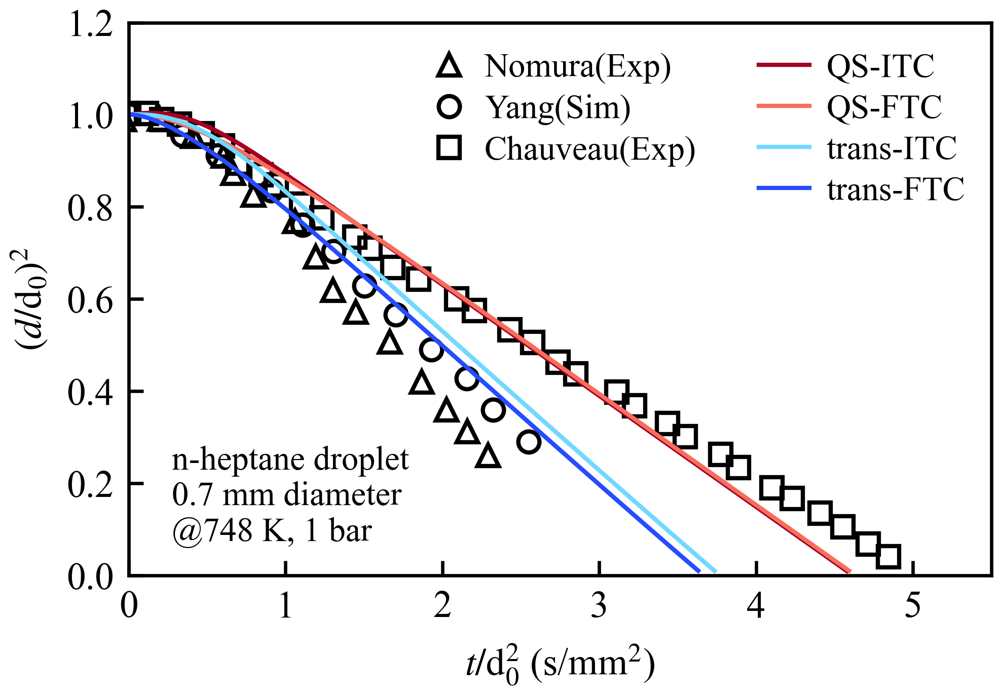
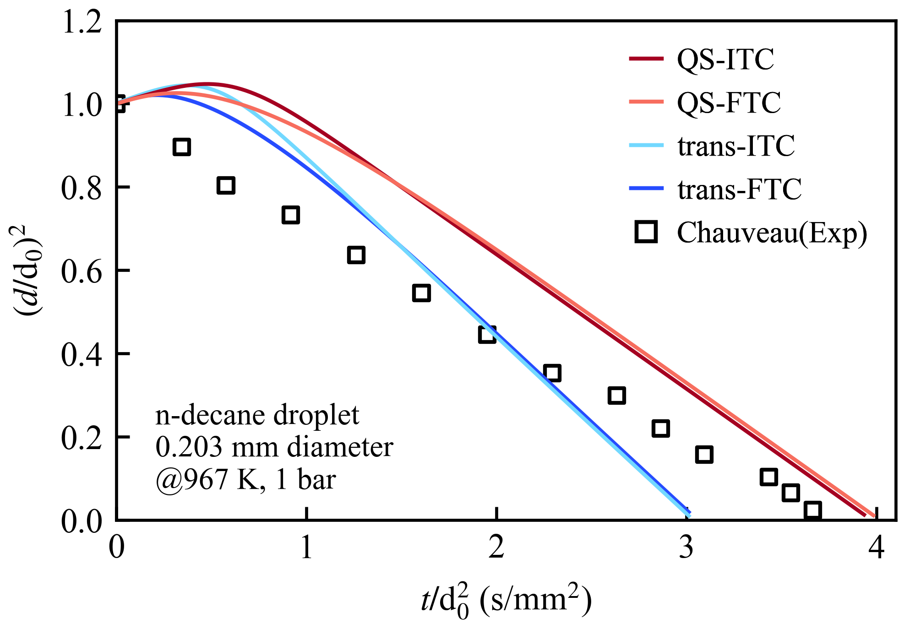
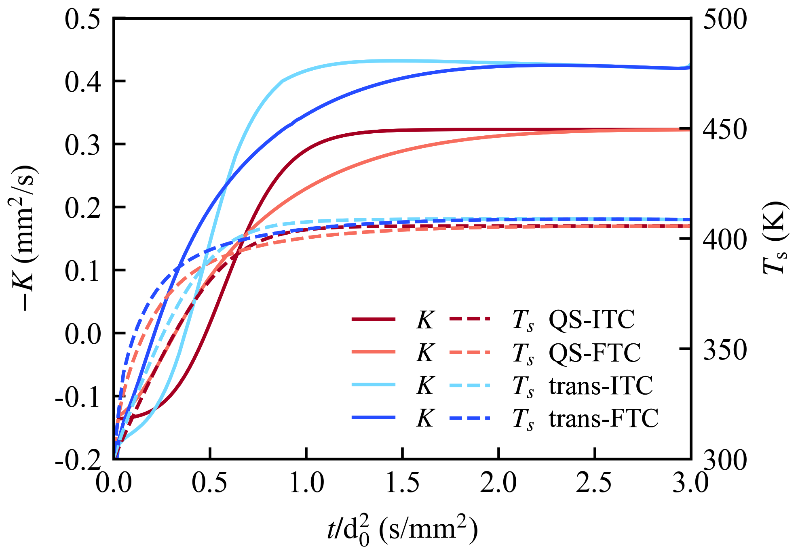
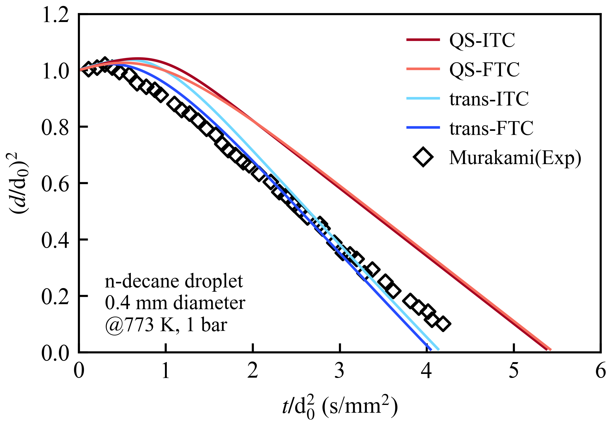
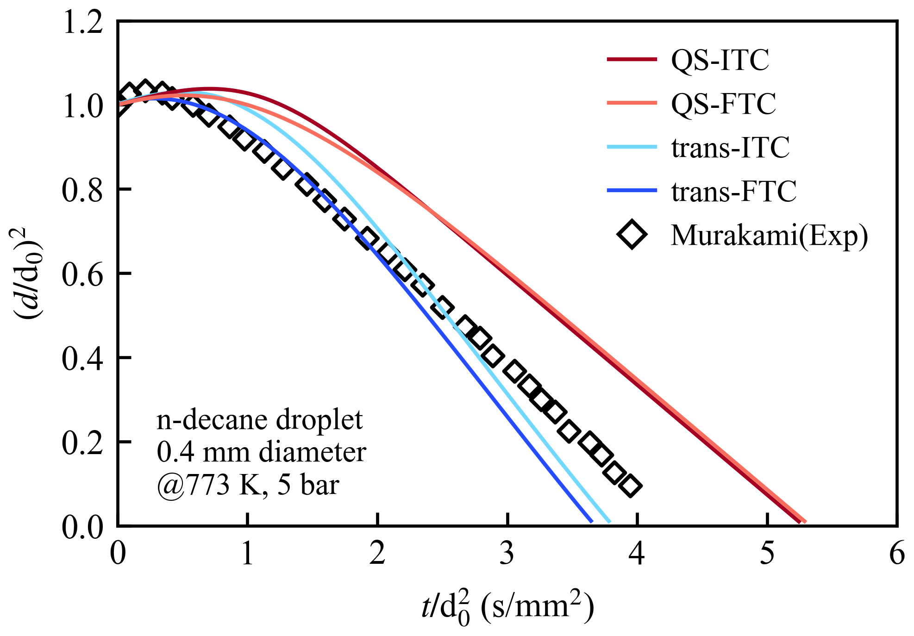

# 🔥 DropletPalette - Spherical Symmetry Droplet Evaporation and Combustion Model

## 📖 How to Cite?

If you use this code, we would greatly appreciate if you cite as follows:

```
Sun, Y., & Liu, Y. C. (2025). DropletPalette: Spherical Symmetry Droplet Evaporation and Combustion Model for Complex Fuel Compounds (v1.0.1). Zenodo. https://doi.org/10.5281/zenodo.17566401
```

bib file
```
@software{DropletPalette2025,
  author       = {Sun, Yuhang and
                  Liu, Yu Cheng},
  title        = {DropletPalette: Spherical Symmetry Droplet
                   Evaporation and Combustion Model for Complex Fuel
                   Compounds
                  },
  month        = nov,
  year         = 2025,
  publisher    = {Zenodo},
  version      = {v1.0.1},
  doi          = {10.5281/zenodo.17566401},
  url          = {https://doi.org/10.5281/zenodo.17566401},
  swhid        = {swh:1:dir:ffce60e111e614384f0c1118bafa1e1d116d0f47
                   ;origin=https://doi.org/10.5281/zenodo.17566400;vi
                   sit=swh:1:snp:fd32c171c6fcb11bc3d28e3c8611d8a10647
                   6fb9;anchor=swh:1:rel:85f8eeab57494ca9c8921bb1522f
                   cb91b71a6a93;path=YCLiu-Lab-DropletPalette-9eacbfa
                  },
  note         = {Available at: \url{https://github.com/YCLiu-Lab/DropletPalette}}
}
```
---
## 🚀 Project Features

- ✨ Spherical symmetry droplet evaporation model
- 🔥 Complex fuel compound combustion reactions
- 📊 High-precision numerical solvers and Surface solving
- 🧪 Experimental validation support

## 📁 Project Structure

```
droplet_combustion_simulation1D/
├── src/                    # Source code directory
│   ├── core/              # Core modules
│   ├── solvers/           # Solvers
│   └── solution/          # Solutions
├── Mech/                  # Mechanism files
├── result/                # Result outputs
└── main.py               # Main program entry
```

---


## 🚀 Quick Start

### 📋 Prerequisites

- Python 3.10
- Git

### 🔧 Installation

1. **Clone the repository**
   ```bash
   git clone https://github.com/YCLiu-Lab/DropletPalette.git
   cd droplet_combustion_simulation1D
   ```

2. **Create a virtual environment by conda (recommended)**
   ```bash
   # Using conda
   conda create -n DropletPalette python=3.9
   conda activate DropletPalette

   # other environment management tools are ok

3. **Install dependencies**
   ```bash
   pip install -r requirements.txt
   ```

### 🏃‍♂️ Running the Simulation
1. **Basic Usage**
   ```bash
   python main.py
   ```

2. **Modify Parameters**
   
   Edit parameters in `main.py` file to customize your simulation:
   
   ```python
   # Modify case name
   case_name = "my-simulation"
   
   # Modify fuel composition (mole fraction array of 40 components)
   fuel_composition = np.zeros(40)
   fuel_composition[0] = 0.66  # n-Heptane
   fuel_composition[9] = 0.34  # n-Hexadecane
   
   # Modify droplet parameters
   droplet_radius = 5.5e-4     # Droplet radius [m]
   boundary_temperature = 973.0 # Boundary temperature [K]
   initial_pressure = 1.0e5     # Initial pressure [Pa]
   initial_temperature = 300.0  # Initial temperature [K]
   
   # Modify grid parameters
   liquid_cell_count = 40       # Liquid phase grid count
   gas_cell_count = 200         # Gas phase grid count
   initital_time_step = 1E-4    # Time step [s]
   
   # Modify solver types
   liquid_solver_type = 'ITCID'      # Liquid solver: ITCID/FTCID/ITCFD/FTCFD
   gas_solver_type = 'Quasi_Steady'  # Gas solver: evap/react/Quasi_Steady
   ```

3. **Output Results**
   
   Simulation results will be saved in `result/{case_name}/` directory:
   - `{case_name}.log`: Simulation log file
   - Various charts and data files

### 🔍 Key Parameters Explained

- **fuel_composition**: Fuel composition array of 40 components, corresponding to C7-C16 straight-chain alkanes, branched alkanes, cycloalkanes, and aromatic hydrocarbons
- **liquid_solver_type**: 
  - `ITCID`: Infinite heat and mass transfer
  - `FTCID`: Finite heat transfer, infinite mass transfer
  - `ITCFD`: Infinite heat transfer, finite mass transfer
  - `FTCFD`: Finite heat and mass transfer
- **gas_solver_type**:
  - `evap`: Evaporation simulation only
  - `react`: Combustion reaction simulation
  - `Quasi_Steady`: Quasi-steady state simulation
- **liquid_property**
  - in src/solution/liquid_para
- **gas_property**
  - in mech/**.yaml (currently includes 31 common hydrocarbon fuels)
---

## ✅ Validation Experiment Results

### 🔬 Single-Component Evaporation

#### ⛽ n-Heptane

* Simulation setting: T∞ @ 748K, P @ 1bar
* Nomura Experiment： T∞ @ 741K, P @ 1bar
* Chauveau Experiment：T∞ @ 748K, P @ 1bar

<p align="center">
  
  
</p>

<p align="center">
  <em>n-Heptane validation of normalized radius and surface temperature</em>
</p>

> Chauveau C, Birouk M, Halter F, et al. An analysis of the droplet support fiber effect on the evaporation process[J]. International Journal of Heat and Mass Transfer, 2019, 128: 885-891.

> Yang J R, Wong S C. On the discrepancies between theoretical and experimental results for microgravity droplet evaporation[J]. International Journal of Heat and Mass Transfer, 2001, 44(23): 4433-4443.


#### ⛽ n-Decane
<p align="center">
  
  
</p>

<p align="center">
  <em>n-Decane validation of normalized radius and surface temperature</em>
</p>

> Chauveau C, Birouk M, Gökalp I. An analysis of the d²-law departure during droplet evaporation in microgravity[J]. International Journal of Multiphase Flow, 2011, 37(3): 252-259.

<p align="center">
  
  
</p>

<p align="center">
  <em>n-Decane validation of normalized during different pressure</em>
</p>


> MURAKAMI Y, NOMURA H, SUGANUMA Y. Experimental Study on Unsteadiness of n-decane Single Droplet Evaporation and Effect of Natural Convection on Droplet Evaporation at High Pressures and Temperatures [J]. Transactions of the Japan Society for Aeronautical and Space Sciences, Aerospace Technology Japan, 2021, 19(5): 647-53.


### 🔬 multi-Component Evaporation

#### ⛽ n-Heptane and n-Dodecane

* 50% n-Heptane + 50% n-Dodecane (volume) @673 K, 1 bar

<p align="center">
  
</p>

<p align="center">
  <em>multi-component validation of normalized radius and surface</em>
</p>
<p align="center">
  
  
</p>

<p align="center">
  <em>multi-component validation of surface temperature and evaporation constant</em>
</p>

> GHASSEMI H, BAEK S W, KHAN Q S. Experimental Study on Evaporation of Kerosene Droplets at Elevated Pressures and Temperatures [J]. Combustion Science and Technology, 2006, 178(9): 1669-84.


### 🔬 Single-Component Ignition
#### ⛽ n-Heptane, Isooctane, n-Dodecane
* $T> 2000 K$ as the criterion for ignition @ 1 bar
<p align="center">
  
</p>

<p align="center">
  <em>ignition time validation for n-Heptane(NA7), Isooctane(IA8), n-Dodecane(NA12) </em>
</p>

> TANABE M, BOLIK T, EIGENBROD C, et al. Spontaneous ignition of liquid droplets from a view of non-homogeneous mixture formation and transient chemical reactions [J]. Symposium (International) on Combustion, 1996, 26(1): 1637-43.

### 🔬 Multi-Component Ignition
#### ⛽ 50% n-Heptane + 50%n-Dodecane
* $T> 2000 K$ as the criterion for ignition @ 1 bar
<p align="center">
  
</p>

<p align="center">
  <em>ignition time validation for 50% n-Heptane and 50% n-Dodecane </em>
</p>

> TAKEI M, TSUKAMOTO T, NIIOKA T. Ignition of blended-fuel droplet in high-temperature atmosphere [J]. Combustion and Flame, 1993, 93(1-2): 149-56.

---
## ✅ Validation for different $\frac{\Delta x}{\Delta t}$
### 🔬 differernt $\Delta x$ and $\Delta t$
<p align="center">
  
  
  
</p>

<p align="center">
  <em>validation for differernt grid number and time step </em>
</p>

---
## 📧 Contact Information

- **Corresponding Email**: ycliu7@tsinghua.edu.cn
- **Technical Support**: syh20@mails.tsinghua.edu.cn / 18801300138 (Wechat)

## 📄 License

This project is licensed under the MIT License - see the [LICENSE](LICENSE) file for details.

*Thank you for using the DropletPalette project!* 🌟
